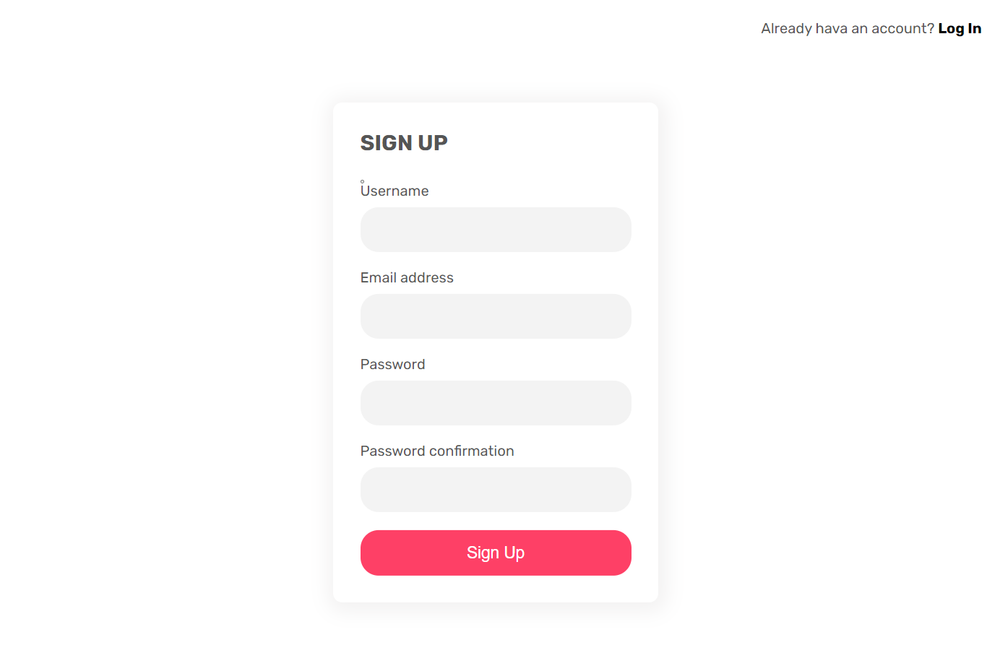
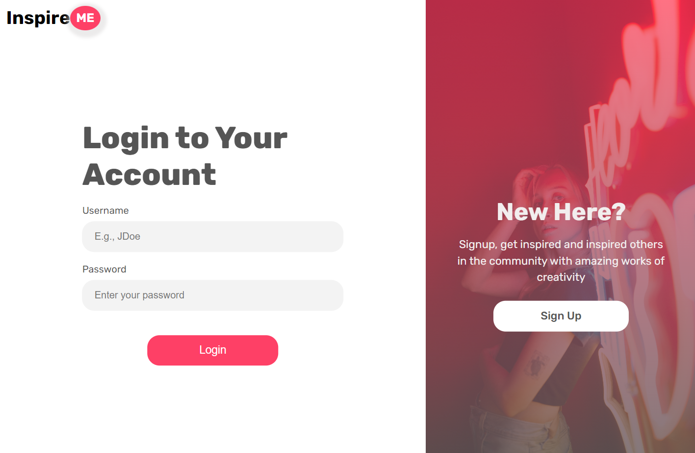
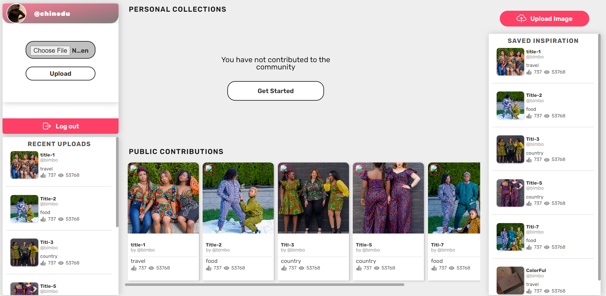
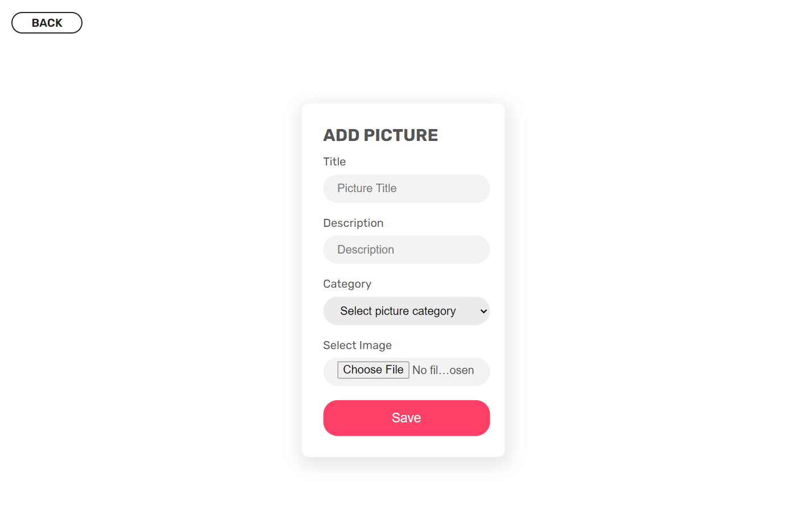

# InspireME
A photo Django-based web application that helps users collect interesting photographs, creating personal collections which will made public for other users to gain inspiration from. Users can get inspiration from contributions from the public space. The app implements authentication and authorization and has a sleep and simple user interface.

## Screenshots
### InspireME Login/Authentication Page

    

 

### InspireME Registration Page

    

 

### InspireME Dashboard Page

    

 

### InspireME Upload Page

    

